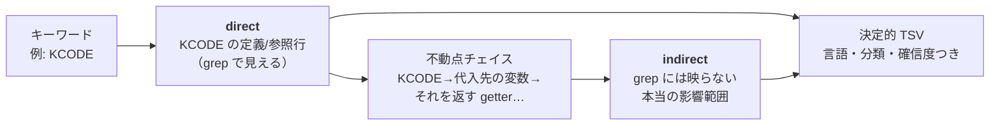
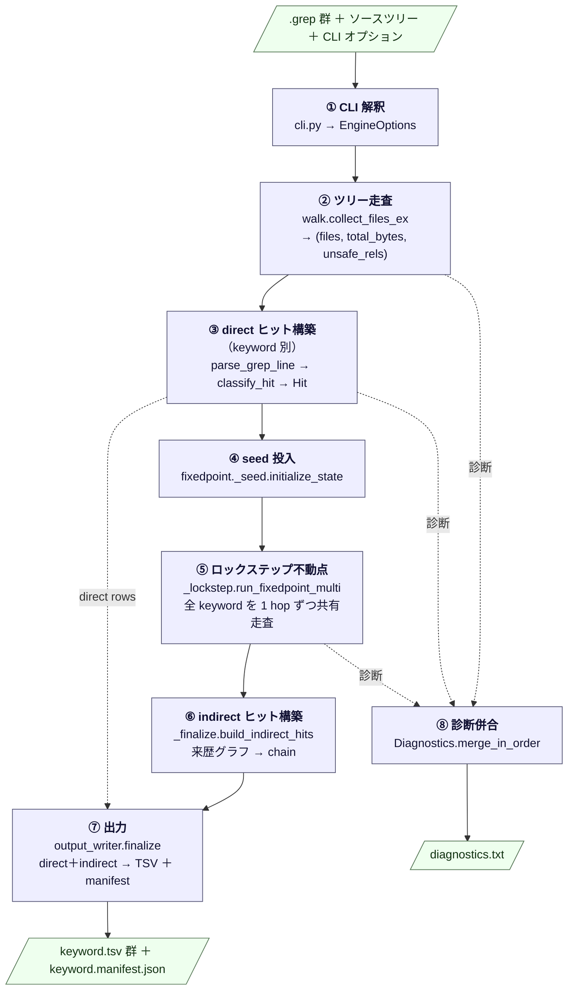
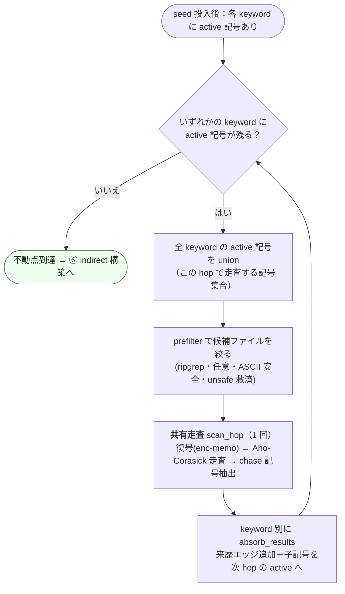
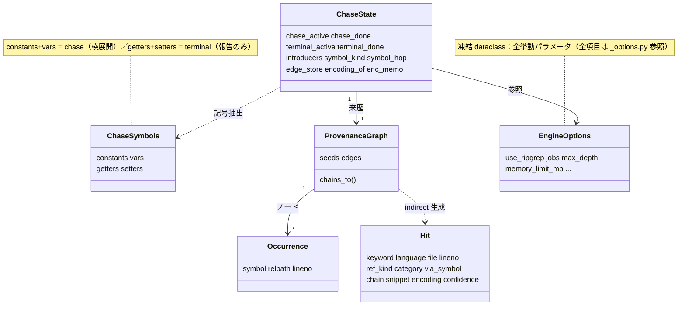
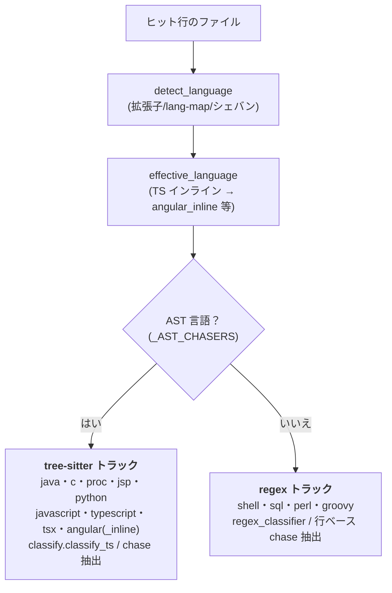

# grep_analyzer アーキテクチャ概観（横断設計書 / North Star）

> **この文書の位置づけ** — 人間が「このアプリがどう動くか」を最短で掴むための **北極星（俯瞰地図）** です。
> 入力から出力までの **処理フロー**、各ステージを担う **モジュール**、システム全体を貫く **不変条件（invariants）** を、
> 図とともに 1 本にまとめます。
>
> - **詳細の正本は各 spec**（`docs/superpowers/specs/`）と **コードそのもの**です。本書はそれらへの入口（地図）であって、
>   個別ルールの正本ではありません。両者が食い違ったら **コード → spec → 本書** の順で信頼してください。
> - 本書は **古くなりにくい高度（altitude）** に保っています：行番号や揮発しやすい実装詳細は持たず、
>   めったに変わらない「処理の流れ・モジュールの責務・不変条件」だけを記述します（[保守の指針](#この文書を古くしないために)）。

関連：[README](../README.md)（何ができるか／なぜ要るか） / [spec 索引](#spec-索引)

---

## 1. 30 秒でわかる全体像

`grep_analyzer` は、`grep -rn`（または `rg`）の結果と元ソースツリーを入力に取り、
**キーワードの「本当の影響範囲」を決定的な TSV にして出力する** ツールです。

素の grep は「文字どおり一致した行」しか出しませんが、本ツールは direct ヒットを起点に
**定数 → 変数 → getter/setter … と参照を「もう増えなくなるまで」たどり（＝不動点）**、
grep には映らない **間接（indirect）参照まで** 洗い出します。

**設計の最上位不変条件＝決定性（determinism）。** 同一入力・同一オプションなら、
走査順・並列数（`jobs`）に関係なく **常にバイト同一の TSV** を返します。
これによりブランチ間・実行間の **差分が意味を持ち**、レビューや承認の証跡に使えます。

- Python 3.12／標準ライブラリ中心 ＋ tree-sitter・chardet・pyahocorasick
- オフライン Linux（aarch64／x86_64）配備：`wheelhouse/` ＋ `requirements.lock` ＋ 同梱 ripgrep

---

## 2. 処理パイプライン（全体）

入力（`.grep` 群・ソースツリー・オプション）から出力（`keyword.tsv` 群・`diagnostics.txt`）まで、
処理は 8 ステージで進みます。`pipeline.run` がオーケストレータです。

各ステージの責務・担当モジュール・担当 spec：

| # | ステージ | 役割 | 主な担当モジュール | 主な担当 spec |
|---|---------|------|------------------|--------------|
| ① | CLI 解釈 | 引数を `EngineOptions`（凍結 dataclass）に変換 | `cli.py`, `__main__.py`, `fixedpoint/_options.py` | §6 入力契約 |
| ② | ツリー走査 | 決定的にファイル列挙。総バイト数と非ASCII透過（unsafe）集合も算出 | `walk.py` | perf §4.4／§5 |
| ③ | direct 構築 | 各 `.grep` を解釈し、言語判定・分類して direct `Hit` を作る | `pipeline.py`, `ingest.py`, `dispatch.py`, `classify.py` | §6／§7 |
| ④ | seed 投入 | direct ヒット行から chase 記号を抽出し追跡状態へ投入（hop=1） | `fixedpoint/_seed.py`, `chase.py` | §8.1／§8.2 |
| ⑤ | 不動点 | 全 keyword を 1 hop ずつ前進させ、union 記号を共有走査して間接参照を追跡 | `fixedpoint/_lockstep.py`, `_scan.py`, `_ingest.py` | perf §4.1／§8 |
| ⑥ | indirect 構築 | 来歴グラフを辿って間接 `Hit` と chain 文字列を生成 | `fixedpoint/_finalize.py`, `provenance.py`, `snippet/` | §8.2／§9 |
| ⑦ | 出力 | direct＋indirect を決定的に整列し TSV＋manifest を原子的に書く | `output_writer.py`, `tsv.py`, `model.py` | §9 TSV スキーマ |
| ⑧ | 診断併合 | walk・keyword 別の診断を逐次版と同順に併合して出力 | `diagnostics.py` | §10.3 |

> **入力契約**：`.grep` の各行は `path:lineno:content`（`grep -rn` 形式）。`ingest.parse_grep_line` は
> **生バイトのまま** `path` を取り出し `os.fsdecode` するため、SJIS 混在のファイル名でも FS と一致します。

---

## 3. 中核：ロックステップ不動点エンジン

本ツールの心臓部は **不動点（fixed point）チェイス** です。direct ヒットを seed に、
記号（定数・変数・getter・setter）を多ホップ追跡し、**新しい記号が増えなくなるまで** 反復します。

### 3.1 chase 記号と terminal 記号

`chase.py` が 1 行／AST から抽出する記号（`ChaseSymbols`）は 2 系統に分かれます。

| 系統 | 種別 | 不動点での扱い |
|------|------|--------------|
| **chase**（横展開する） | `constant`・`var` | 参照先をさらに追跡（次 hop へ投入） |
| **terminal**（報告のみ） | `getter`・`setter` | ヒットは記録するが **展開しない**（§8.4 全件報告・確信度 low） |

`stoplist.partition` が言語キーワード・短すぎる記号・ユーザ stoplist を弾いて
chase／terminal／rejected に仕分けます。

### 3.2 hop ループ（共有走査）

`_lockstep.run_fixedpoint_multi` は **全 keyword を 1 グローバル hop ずつ同時に** 前進させます。
各 hop で全 keyword の active 記号を **union（和集合）** にし、**コーパス走査を 1 回だけ共有** します
（rg prefilter → 復号 → Aho-Corasick → chase 記号抽出）。結果は keyword 別に absorb します。

**なぜ速いか（perf 設計の眼目）**：逐次版は keyword ごとにコーパスを走査するため
走査回数は `Σ hop_k`（≈ keyword 数 × 平均 hop 数）でした。ロックステップは
**`max hop_k`（≈ グローバル hop 数）** に圧縮します。重い処理（chardet 復号・tree-sitter パース・automaton 走査）を
全 keyword で 1 回ずつに共有するのが要点です（rg 呼び出し自体は安価）。

**なぜ必ず停止するか（§8.1）**：追跡記号は元ソースの字句のみ＝有限。採用集合（`chase_done`／`terminal_done`）は
**単調増加**（一度入れたら消さない。cap は走査除外のみ）。よって高々 |記号母集合| 回で飽和します。
加えて **`--max-depth`（既定 10）がグローバル hop の上限** として毎回の主たる停止条件になり、
`--max-symbols`／`--max-paths` がメモリ・組合せ爆発の安全弁です。

**なぜ単一 keyword でロックステップ＝逐次版とバイト同一か**：union が 1 keyword 分に縮退し、
共有走査・absorb・automaton 単調性（記号追加で既存ヒットは不変）により、逐次版と同値になります。
`run_fixedpoint`（単一 keyword）は `run_fixedpoint_multi` への薄い委譲ラッパです。

### 3.3 direct → indirect への変換（来歴グラフ）

scan で見つかった子は **来歴エッジ**（親 Occurrence → 子 Occurrence）として `edge_store` に積まれます。
hop ループ終了後、`build_indirect_hits` がグラフを辿り、各 seed から各 indirect 到達点までの
**chain（`記号@ファイル:行 -> …`）** を列挙して間接 `Hit` を生成します（seed と同じ位置は direct 済みなので除外）。

---

## 4. 横断的関心事（不変条件）

システム全体を貫く性質です。**ここが本ツールの「らしさ」**であり、変更時に最も注意すべき箇所です。

### 4.1 決定性（最上位不変条件）
同一入力・同一オプションなら、**走査順・並列数（`jobs=1`==`jobs=N`）に関わらずバイト同一**。
担保点：walk の relpath ソート（`walk.py`）／scan 結果の `(lineno, symbol)` 再ソート（`_scan.py`）／
記号の決定的キャップ順 `(symbol_hop, len, name)`（`_budget_control.py`）／chain の DFS をソート列挙（`provenance.py`）／
出力の全項目ソート `model.sort_key`（`output_writer.py`）。golden テスト群がバイト一致を回帰ロックします。

### 4.2 文字コード（非 UTF-8 レガシー対応）
`encoding.decode_bytes` は **決して例外で落とさない** フォールバック鎖：
**utf-8 厳格 → chardet 検出 → cp932 → euc-jp → latin-1(置換)**。置換が起きた行は `encoding` 列に「要確認」を付け、
`decode_replaced` 診断を出します。`decode_with_memo` ＋ `EncMemo`（run 共有）により
**chardet は「ユニークファイル × run 全体で 1 回」** に削減されます（0.1MB/s の chardet がボトルネックなので効く）。
並列時は worker ごとに独立メモ（プロセス境界）＝出力は不変。

### 4.3 ripgrep prefilter（任意の候補絞り込み）
`ripgrep.prefilter` は記号の部分一致で候補ファイルを **上位集合** として絞ります（walk の上位集合・出力不変）。
- **ASCII 安全ガード**：非 ASCII 記号は非 UTF-8 ファイルでバイト不一致になり取りこぼすため、
  非 ASCII を含む hop は prefilter を **無効化**（全件走査）して出力を保証します。
- **unsafe 救済**：UTF-16/32 BOM ファイル（`walk._classify_bytes`＝非ASCII透過）は rg が ASCII 記号を見つけられないため、
  `keep ∪ unsafe_rels` で **常に走査対象に残します**。
- **tri-state ＋ 閾値**：`use_ripgrep` は `None`（既定＝総バイト ≥ 1GiB かつ rg 解決可能なら自動 ON）／`True`／`False`。
- **rg 解決**：`_resolve_rg` が env → 同梱 → PATH の順で解決（sha256 照合・実行スモーク）。`available()` は副作用フリーな gate ヒント。

### 4.4 予算とスピル（巨大コーパス耐性）
`--memory-limit` 超過時、`_budget_control` が記号を決定的にキャップし（`symbol_rejected`）、
来歴エッジを `spill.EdgeStore` がディスクへ退避します（`graph_spilled`）。
`sorted_unique()` はメモリ／ディスクいずれでも同一の整列結果を返します。

### 4.5 並列性（worker isolation）
`jobs>1` で `multiprocessing.Pool` を **run 単位に 1 度だけ** 生成。worker は automaton・ファイルキャッシュ・enc-memo を
**プロセスローカル** に持ち、追跡状態は受け取りません（pickle 制約＋決定性）。chunk 署名（内容ハッシュ）で automaton 再構築を抑止。

### 4.6 診断（非致命の観測ログ）
`diagnostics.txt` は `# summary`（カテゴリ別件数・常に真総数）＋ `# detail`。
§8.4 全件性カテゴリ（`symbol_rejected`・`getter_setter_no_expand`・`prov_*`）は縮約免除。
ロックステップでは keyword 別の診断を `merge_in_order` で **逐次版と同順** に併合します
（`automaton_split`・`graph_spilled` は走査構造依存ゆえバイト比較の対象外）。

### 4.7 オフライン配備
`wheelhouse/` ＋ `requirements.lock` で再現インストール。ripgrep は供給網外のため
`scripts/fetch_ripgrep.py` で版・URL・sha256 をピンした同梱物を取得し（aarch64／x86_64・版は同スクリプトに固定）、
`rg.sha256` サイドカーが唯一の完全性保証。配備モデルはディレクトリインストール前提。

---

## 5. データモデル（主要構造）

中核の値オブジェクトと関係です（**全フィールドはコード参照**。ここは関係の高度に留めます）。

| 構造 | 定義 | 役割 |
|------|------|------|
| `Hit` | `model.py` | 出力 1 行。`ref_kind` は `direct` か `indirect:{constant\|var\|getter\|setter}` |
| `ChaseSymbols` | `model.py` | 行/AST から抽出した記号の 4 つ組（chase=constants+vars／terminal=getters+setters） |
| `Occurrence` | `provenance.py` | 来歴グラフのノード `(symbol, relpath, lineno)`（凍結・順序付き＝決定的） |
| `ProvenanceGraph` | `provenance.py` | seed と来歴エッジを保持し、`chains_to` で chain を決定的に列挙 |
| `ChaseState` | `fixedpoint/_state.py` | 1 keyword 分の不動点状態（main プロセス専有） |
| `EngineOptions` | `fixedpoint/_options.py` | 全挙動パラメータ（凍結 dataclass・CLI から構築） |

---

## 6. TSV 出力スキーマ

`output_writer.finalize` が direct＋indirect を `model.sort_key` で整列し、`{keyword}.tsv`（必要なら `.partNNN.tsv` 分割）と
`{keyword}.manifest.json`（行数・`data_sha256`・版）を **原子的に** 書きます。
`--resume` 時は manifest の sha256・版が一致する keyword をスキップします。

| 列 | 意味 |
|----|------|
| `keyword` | 検索キーワード |
| `language` | 判定言語（java/c/shell/sql/typescript…） |
| `file` `lineno` | ヒット位置（source-root からの相対＋絶対化） |
| `ref_kind` | `direct` / `indirect:constant\|var\|getter\|setter` |
| `category` `category_sub` | 分類（宣言/代入/比較/分岐/return/コメント/その他…） |
| `usage_summary` `via_symbol` `chain` | 要約・経由記号・来歴チェイン |
| `snippet` | 周辺コード片 |
| `encoding` | 検出エンコーディング（置換時は「要確認」） |
| `confidence` | high / medium / low |

---

## 7. 言語サポートと分類

`dispatch.detect_language`（拡張子 → lang-map → シェバン → `EXEC SQL` 推定）で言語を判定し、2 トラックに振り分けます。

- 埋め込み言語は `embed_preprocess`／`proc_preprocess` が **行数を保ったまま** ホスト言語以外をマスクします
  （Pro\*C の `EXEC SQL`、JSP マークアップ、Angular テンプレート、TS インラインテンプレート）。
- `classify_hit` がヒット行を **宣言/代入/比較/分岐/return/コメント/その他** に分類し確信度を付けます。

---

## 8. モジュール地図

| モジュール | 責務 |
|-----------|------|
| `cli.py` / `__main__.py` | 引数解釈 → `EngineOptions` |
| `pipeline.py` | オーケストレータ（②〜⑧を統括） |
| `walk.py` | 決定的ツリー走査・バイト分類（binary/unsafe/ok）・`collect_files_ex` |
| `ingest.py` | `.grep` 行の生バイト安全パース |
| `dispatch.py` | 言語・シェル方言の判定 |
| `embed_preprocess.py` / `proc_preprocess.py` | 埋め込み言語の行数保存マスク |
| `classifiers/` | 言語別 chaser（AST／regex）と tree-sitter 分類器 |
| `chase.py` | chase 記号抽出（`ChaseSymbols`） |
| `classify.py` | ヒット行のカテゴリ・確信度判定 |
| `stoplist.py` | 記号の採用方針（`partition`／`SymbolPolicy`） |
| `automaton.py` | Aho-Corasick 構築・語境界つき走査 |
| `fixedpoint/` | 不動点エンジン（下表） |
| `provenance.py` | 来歴グラフ・chain 列挙 |
| `encoding.py` / `fixedpoint/_encmemo.py` | 復号フォールバック鎖・chardet メモ化 |
| `ripgrep.py` | 任意 rg prefilter・rg 解決・同梱 |
| `budget.py` / `spill.py` | メモリ予算・エッジのディスク退避 |
| `snippet/` | コード片切り出し |
| `diagnostics.py` | 非致命診断の集約・併合・描画 |
| `output_writer.py` / `tsv.py` / `model.py` | 整列・TSV／manifest 出力・データモデル |
| `resume.py` | 完了 keyword の判定（再開） |

**`fixedpoint/` パッケージ内訳：**

| モジュール | 責務 |
|-----------|------|
| `__init__.py` | `run_fixedpoint`（単一 keyword 委譲ラッパ）・`EngineOptions` 再 export |
| `_lockstep.py` | `run_fixedpoint_multi`（共有 hop ループ＝中核） |
| `_seed.py` | `initialize_state`（direct → seed 投入） |
| `_scan.py` | `scan_hop`／worker モデル／`_read_meta`（復号メモ階層） |
| `_ingest.py` | `absorb_results`／`ingest_one`（来歴・子記号投入） |
| `_finalize.py` | `build_indirect_hits`（グラフ → 間接 Hit＋chain） |
| `_budget_control.py` | `apply_global_cap`／`maybe_spill`／`compute_nchunks_union` |
| `_state.py` | `ChaseState` |
| `_options.py` | `EngineOptions` |
| `_encmemo.py` | `EncMemo`（LRU 予算つき enc メモ） |

---

## spec 索引

詳細ルールの正本。本書から各 spec へ降りるための索引です（各 spec 冒頭に背景・確定事項あり）。

| spec | 主題 |
|------|------|
| `2026-05-16-grep-analyzer-design.md` | **v1 マスター設計**（目的・アーキ・入力契約・TSV スキーマ・不動点・横断事項） |
| `2026-05-17-grep-analyzer-phase3-design.md` | Phase 3 設計（規模・運用） |
| `2026-05-21-refactor-design.md` | リファクタリング設計（モジュール分割） |
| `2026-05-22-v2-regex-languages-design.md` | v2 正規表現トラック言語（PL/SQL・Perl・Groovy） |
| `2026-05-23-v2-tree-sitter-languages-design.md` | v2 tree-sitter トラック言語（サブプロジェクト A） |
| `2026-05-23-v2-track-c-embedded-design.md` | v2 埋め込みトラック言語（JSP / Angular） |
| `2026-05-23-angular-inline-template-design.md` | Angular インラインテンプレート式抽出 |
| `2026-05-23-chaser-ast-unification-design.md` | java/c/jsp/proc chaser の AST 統一 |
| `2026-05-24-comment-category-design.md` | `コメント` カテゴリ新設 |
| `2026-05-24-golden-realism-robustness-design.md` | golden セットの現実性・堅牢性補強 |
| `2026-05-30-perf-chardet-prefilter-design.md` | **性能設計**（ロックステップ共有エンジン／chardet メモ化／rg 同梱／prefilter 既定 ON） |

> spec が示す「§n」は v1 マスター設計の節番号で、後続 spec も参照します。本書の各表の「担当 spec」列も同様。

---

## この文書を古くしないために

本書は **北極星**＝俯瞰地図です。地図が現地とズレると害になるため、次の運用で鮮度を保ちます。

1. **高度（altitude）を守る。** 行番号・関数シグネチャ・フィールド全列挙など **揮発しやすい詳細は書かない**。
   記述対象は「処理フロー」「モジュールの責務」「不変条件」「データモデルの関係」に限定する。詳細はコードと spec が正本。
2. **更新の引き金（いつ直すか）。** 次のときに本書を見直す：
   - 処理ステージの **追加・順序変更**（②〜⑧の構成が変わる）
   - **新しい横断的不変条件** の導入・変更（決定性／文字コード／prefilter／予算／並列 など）
   - **新言語トラック**や**新モジュール**の追加（モジュール地図・言語表）
   - **新しい spec** の追加（spec 索引）
   逆に、関数内部の実装変更・行番号の移動・テスト追加では **本書を触らなくてよい**（だからこそ揮発詳細を持たない）。
3. **図は Mermaid（テキスト）で。** 差分が取れ、GitHub 上でレンダリングされ、レビューできる。画像バイナリは持たない。
4. **正本の序列。** 食い違いがあれば **コード → 各 spec → 本書** の順で信頼し、本書を現実に合わせて直す。
5. **AI エージェントへ。** 横断的なフロー・不変条件・モジュール構成を変える変更を入れたら、
   個別 spec とコードに加えて **本書（特に §2 図・§4 不変条件・§8 モジュール地図）の整合を最後に確認** すること。
